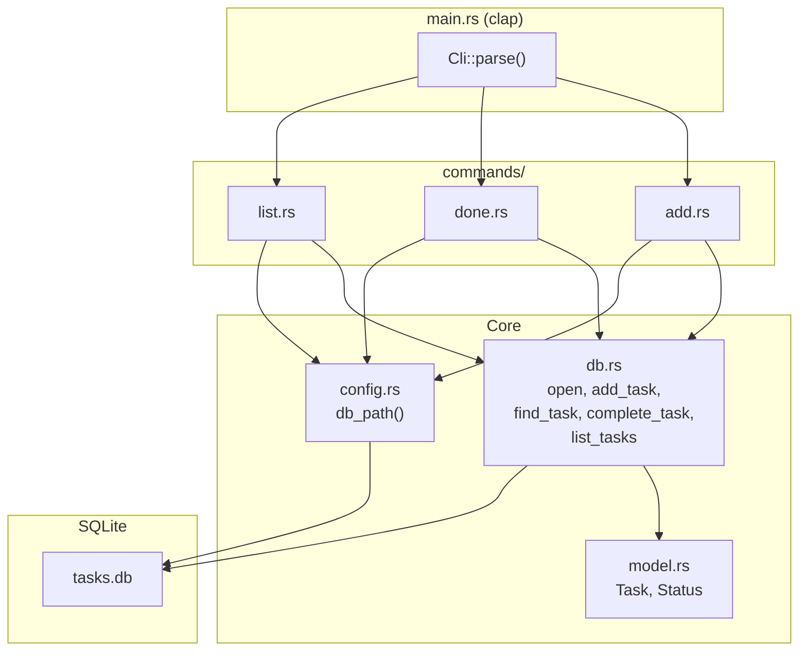

# my-task Phase 1 MVP 実装プラン

## 前提

- プロジェクトディレクトリ `/Users/mad-tmng/lab/rust/my-task` にはまだ Rust コード・`Cargo.toml` が存在しない
- [docs/OVERVIEW.md](docs/OVERVIEW.md)（要件定義書）と [IMPLEMENT_PLAN.md](IMPLEMENT_PLAN.md)（実装プラン）をそのまま準拠して実装する
- 技術スタック: Rust / SQLite (rusqlite bundled) / clap (derive) / chrono / dirs

## アーキテクチャ



## 実装ステップ

### Step 1: Cargo プロジェクト初期化 + clap 定義

- `cargo init --name my-task` でプロジェクトを初期化
- `Cargo.toml` に依存関係を記述（clap, rusqlite, chrono, dirs, tempfile, assert_cmd, predicates）
- `[[bin]]` セクションでバイナリ名を `my-task`、パッケージ名を `my_task` に設定
- `src/main.rs` に clap の `Parser` / `Subcommand` 定義の骨格を作成
- `src/commands/mod.rs` にモジュール宣言を作成
- 完了基準: `cargo run -- --help` でサブコマンド一覧が表示される

### Step 2: データモデル + db モジュール実装

- `src/model.rs`: `Task` 構造体と `Status` enum を定義（IMPLEMENT_PLAN.md のコード準拠）
- `src/db.rs`: SQLite 接続・スキーマ初期化（WAL モード）・CRUD 関数を実装
  - `open()`, `add_task()`, `find_task()`, `complete_task()`, `list_tasks()`, `row_to_task()`
- `src/config.rs`: `db_path()` 関数（`MY_TASK_DATA_FILE` 環境変数 -> XDG パス フォールバック）
- db.rs 内にユニットテスト 3 件:
  - `test_open_creates_schema`
  - `test_add_and_find`
  - `test_complete_task`

### Step 3: add コマンド実装

- `src/commands/add.rs`: `AddArgs` 定義 + `run()` 関数
  - タイトル空文字チェック -> INSERT -> stdout に `Added: #<ID> <title>`
- `main.rs` のマッチ分岐で `commands::add::run` を呼び出し
- 統合テスト `tests/add_test.rs` 3 件:
  - `test_add_basic`, `test_add_with_options`, `test_add_auto_id`

### Step 4: list コマンド実装

- `src/commands/list.rs`: `ListArgs` 定義 + `run()` 関数
  - フィルタ条件に応じた SELECT -> フォーマット表示 -> フッター出力
  - 0 件時: `No tasks. Add one with: my-task add "task title"`
  - `--all` 時: 完了タスクに `✓` 付与、`done M/D` 表示
- 統合テスト `tests/list_test.rs` 3 件:
  - `test_list_empty`, `test_list_shows_open`, `test_list_filter_project`

### Step 5: done コマンド実装

- `src/commands/done.rs`: `DoneArgs` 定義 + `run()` 関数
  - ID 検索 -> 存在チェック -> 完了済みチェック -> UPDATE -> stdout に `Done: #<ID> <title>`
- 統合テスト `tests/done_test.rs` 3 件:
  - `test_done_basic`, `test_done_not_found`, `test_done_already_done`

### Step 6: エッジケース対応 + 仕上げ

- 追加テスト 2 件: `test_add_empty_title`, `test_list_all_flag`
- エラーメッセージを全て stderr 出力に統一
- 終了コード: 正常=0, エラー=1
- `cargo test` で全 14 件パス、`cargo clippy` で警告なしを確認

## 最終ファイル構成

```
src/
  main.rs          -- エントリポイント（clap CLI 定義）
  commands/
    mod.rs         -- コマンドモジュール定義
    add.rs         -- add コマンド実装
    done.rs        -- done コマンド実装
    list.rs        -- list コマンド実装
  model.rs         -- データモデル（Task, Status）
  db.rs            -- SQLite 接続・クエリ
  config.rs        -- パス解決（XDG + 環境変数）
tests/
  add_test.rs      -- add 統合テスト
  done_test.rs     -- done 統合テスト
  list_test.rs     -- list 統合テスト
Cargo.toml
```

## 注意事項

- エラーハンドリングは Phase 1 では `eprintln!` + `std::process::exit(1)` でシンプルに処理（anyhow/thiserror は不使用）
- 日付は ISO 8601 TEXT で SQLite に保存し、Rust 側で `NaiveDate` に変換
- 統合テストは `MY_TASK_DATA_FILE` 環境変数 + `tempfile` で本番パスに影響を与えない
- ユニットテストは `Connection::open_in_memory()` でインメモリ DB を使用
