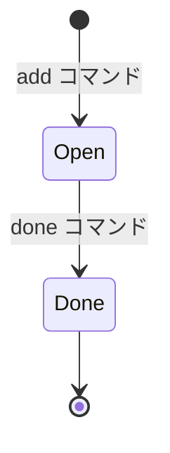

# my-task 要件定義書

> バージョン: Phase 1 MVP
> 作成日: 2026-03-31
> 作成者: Bruce Banner

---

## 1. プロジェクト概要

### 1.1 プロダクト名

**my-task** — シンプルな CLI タスク管理ツール

### 1.2 目的

個人の日常タスクをコマンドラインから素早く追加・完了・一覧表示できるツールを提供する。
GUI やブラウザを開かずにターミナル上で完結するワークフローを実現する。

### 1.3 対象ユーザー

- ターミナルを日常的に使用する開発者・エンジニア
- 単一ユーザー利用を前提とする（マルチユーザー同時アクセスは想定外）

### 1.4 Phase 1 スコープ

Phase 1 では以下の 3 コマンドのみを提供する MVP（Minimum Viable Product）を構築する。

| コマンド | 概要 |
|---------|------|
| `add`   | 新しいタスクを追加する |
| `done`  | タスクを完了にする |
| `list`  | タスク一覧を表示する |

### 1.5 技術スタック

| 項目 | 選定 |
|------|------|
| 言語 | Rust |
| データストア | SQLite（rusqlite, bundled） |
| CLI フレームワーク | clap (derive) |

---

## 2. 用語定義

| 用語 | 定義 |
|------|------|
| タスク (Task) | ユーザーが管理する作業単位。タイトル・ステータス・作成日などのメタデータを持つ |
| ステータス (Status) | タスクの状態。`open`（未完了）または `done`（完了）の 2 値 |
| プロジェクト (Project) | タスクを分類するための任意のラベル。未指定も可 |
| ソース (Source) | タスクの出所。Phase 1 では常に `"private"`（Phase 2 で GitHub・Backlog 等を追加予定） |
| 滞留日数 | タスク作成日から現在までの経過日数 |
| データベースファイル | タスク情報を永続化する SQLite データベース (`tasks.db`) |

---

## 3. 機能要件

### FR-1: タスク追加 (`add`)

**概要:** 新しいタスクを作成し、データベースに永続化する。

**入力:**

```
my-task add "<タイトル>" [--project <プロジェクト名>] [--due <YYYY-MM-DD>]
```

| パラメータ | 必須 | 型 | 説明 |
|-----------|:----:|-----|------|
| `title`   | Yes  | 文字列 | タスクのタイトル（空文字不可） |
| `--project`, `-p` | No | 文字列 | プロジェクト名 |
| `--due`, `-d` | No | 日付 (YYYY-MM-DD) | 期限 |

**振る舞い:**

1. データベースを開く（存在しなければスキーマを自動作成して初期化）
2. タスクを以下の初期値で INSERT する:
   - `id`: AUTOINCREMENT による自動採番
   - `status`: open
   - `source`: "private"
   - `created`: 実行日
   - `updated`: 実行日
   - `done_at`: NULL
3. 標準出力に確認メッセージを表示する: `Added: #<ID> <タイトル>`

**エラー条件:**

| 条件 | メッセージ | 終了コード |
|------|-----------|:----------:|
| タイトルが空文字 | `Error: title cannot be empty` | 1 |
| `--due` のフォーマット不正 | CLI パーサーが自動エラー | 1 |
| データベース書き込み失敗 | `Error: failed to write database: <パス>` | 1 |

---

### FR-2: タスク完了 (`done`)

**概要:** 指定した ID のタスクを完了状態にする。

**入力:**

```
my-task done <ID>
```

| パラメータ | 必須 | 型 | 説明 |
|-----------|:----:|-----|------|
| `id` | Yes | 正の整数 | 完了にするタスクの ID |

**振る舞い:**

1. データベースを開く
2. 指定 ID のタスクを SELECT で検索する
3. `status` を `done`、`done_at` に実行日、`updated` に実行日を設定する UPDATE を実行する
4. 標準出力に確認メッセージを表示する: `Done: #<ID> <タイトル>`

**エラー条件:**

| 条件 | メッセージ | 終了コード |
|------|-----------|:----------:|
| ID が見つからない | `Error: task #<ID> not found` | 1 |
| 既に完了済み | `Error: task #<ID> is already done` | 1 |

---

### FR-3: タスク一覧 (`list`)

**概要:** タスクの一覧を表示する。

**入力:**

```
my-task list [--all] [--project <プロジェクト名>]
```

| パラメータ | 必須 | 型 | 説明 |
|-----------|:----:|-----|------|
| `--all`, `-a` | No | フラグ | 完了タスクも含めて表示する |
| `--project`, `-P` | No | 文字列 | 指定プロジェクトのタスクのみ表示する |

**フィルタルール:**

- デフォルト: `status == open` のタスクのみ表示
- `--all` 指定時: 全ステータスのタスクを表示
- `--project` 指定時: 該当プロジェクトのタスクのみ表示
- フィルタは組み合わせ可能

**表示フォーマット:**

```
 #<ID>  <タイトル>  <プロジェクト>  <期限>  <滞留日数>
```

| 列 | 幅 | 内容 |
|----|-----|------|
| ID | 右寄せ 4 文字 | `#1`, `#12`, `#123` |
| タイトル | 左寄せ、最大 30 文字（超過は切り詰め） | タスク名 |
| プロジェクト | 左寄せ、最大 20 文字 | project 値（未設定なら空白） |
| 期限 | 固定幅 | 期限ありなら `📅 M/D` |
| 滞留日数 | 右寄せ | `Nd`（作成日からの経過日数） |

**完了タスクの表示 (`--all` 時):**

- タイトル先頭に `✓` を付与する
- 滞留日数の代わりに `done M/D` を表示する

**フッター:**

- 通常: `N tasks`
- `--all` 時: `N tasks (M done)`

**タスクが 0 件の場合:**

```
No tasks. Add one with: my-task add "task title"
```

---

## 4. データモデル

### 4.1 Task エンティティ

| フィールド | 型 | 必須 | 説明 |
|-----------|-----|:----:|------|
| `id` | 正の整数 | Yes | タスクの一意識別子（自動採番） |
| `title` | 文字列 | Yes | タスクのタイトル |
| `status` | `open` \| `done` | Yes | タスクの状態 |
| `source` | 文字列 | Yes | タスクの出所（Phase 1 では常に `"private"`） |
| `created` | 日付 (YYYY-MM-DD) | Yes | タスク作成日（自動設定） |
| `project` | 文字列 | No | プロジェクト名 |
| `due` | 日付 (YYYY-MM-DD) | No | 期限 |
| `done_at` | 日付 (YYYY-MM-DD) | No | 完了日（完了時に自動設定） |
| `updated` | 日付 (YYYY-MM-DD) | Yes | 最終更新日（自動設定） |

### 4.2 ステータス遷移



- タスク作成時は常に `open` で開始する
- `open` → `done` への一方向遷移のみ許可する（`done` → `open` への戻しは不可）
- `done` 状態のタスクに再度 `done` を実行するとエラーとなる

### 4.3 SQLite スキーマ

データは SQLite データベースの `tasks` テーブルに保存する。

```sql
CREATE TABLE IF NOT EXISTS tasks (
    id      INTEGER PRIMARY KEY AUTOINCREMENT,
    title   TEXT    NOT NULL,
    status  TEXT    NOT NULL DEFAULT 'open' CHECK(status IN ('open', 'done')),
    source  TEXT    NOT NULL DEFAULT 'private',
    project TEXT,
    due     TEXT,       -- YYYY-MM-DD or NULL
    done_at TEXT,       -- YYYY-MM-DD or NULL
    created TEXT    NOT NULL,  -- YYYY-MM-DD
    updated TEXT    NOT NULL   -- YYYY-MM-DD
);
```

**データの実例:**

```
id | title          | status | source  | project             | due        | done_at    | created    | updated
---|----------------|--------|---------|---------------------|------------|------------|------------|----------
1  | 確定申告の準備  | open   | private | personal            | 2026-04-15 |            | 2026-03-31 | 2026-03-31
2  | CI設定を修正    | open   | private | agent-team-avengers |            |            | 2026-03-31 | 2026-03-31
3  | 歯医者の予約    | done   | private |                     |            | 2026-03-31 | 2026-03-28 | 2026-03-31
```

**スキーマ上のルール:**

- `id` は `AUTOINCREMENT` で自動採番する（手動 max(id) + 1 の実装は不要）
- 日付は ISO 8601 形式の TEXT (`YYYY-MM-DD`) で保存する
- `status` は CHECK 制約で `'open'` / `'done'` のみ許可する
- 任意フィールド (`project`, `due`, `done_at`) は NULL 許容

---

## 5. 非機能要件

### NF-1: データ保存先

XDG Base Directory Specification に準拠する。

| 種類 | パス | デフォルト |
|------|------|-----------|
| データ | `$XDG_DATA_HOME/my-task/tasks.db` | `~/.local/share/my-task/tasks.db` |
| 設定 | `$XDG_CONFIG_HOME/my-task/config.toml` | `~/.config/my-task/config.toml` |

- データディレクトリが存在しない場合は自動作成する
- 環境変数 `MY_TASK_DATA_FILE` によるデータベースファイルパスの上書きをサポートする

### NF-2: データ書き込みの整合性

データの書き込みは SQLite のトランザクションにより整合性を保証する。
アトミック性・耐障害性は SQLite の WAL (Write-Ahead Logging) モードに委任し、自前での実装は行わない。

### NF-3: エラー出力規約

| 項目 | 仕様 |
|------|------|
| 正常メッセージ | 標準出力 (stdout) |
| エラーメッセージ | 標準エラー出力 (stderr) |
| 正常終了コード | 0 |
| エラー終了コード | 1 |

### NF-4: 初回起動時の挙動

- データベースファイルが存在しない場合、スキーマを自動作成して初期化する（エラーにしない）
- 設定ファイルが存在しない場合、デフォルト値で動作する

---

## 6. 制約事項・前提条件

### 6.1 Phase 1 スコープ外

以下の機能は Phase 1 では実装しない。

| 機能 | 理由 |
|------|------|
| タスク同期 (sync) | Phase 2 で GitHub / Backlog 連携として実装予定 |
| 優先度 (priority) | MVP では不要と判断 |
| task.md ファイル生成 | list コマンドの stdout 出力で代替 |
| タスク編集 (edit) | Phase 1 スコープ外 |
| タスク削除 (delete) | Phase 1 スコープ外 |
| 設定ファイルの本格活用 | Phase 2 以降で拡張 |

### 6.2 前提条件

- **単一ユーザー利用**: 同時書き込みは発生しない前提
- **データ規模**: 数十件〜数百件のタスクを想定。SQLite で性能上の問題はない
- **CLI ヘルプ言語**: 英語（CLI の慣例に従う）

---

## 7. Phase 2 以降への展望

Phase 1 完了後、以下の拡張を検討する。

- **外部サービス同期**: GitHub Issues / Backlog との双方向同期 (`source` フィールドの拡張)
- **設定ファイル活用**: `config.toml` によるデフォルトプロジェクト名等のカスタマイズ
- **エラーハンドリング強化**: `anyhow` / `thiserror` による構造化エラー型の導入
- **タスク編集・削除**: `edit` / `delete` コマンドの追加
- **スキーママイグレーション**: フィールド追加時のマイグレーション機構の導入
