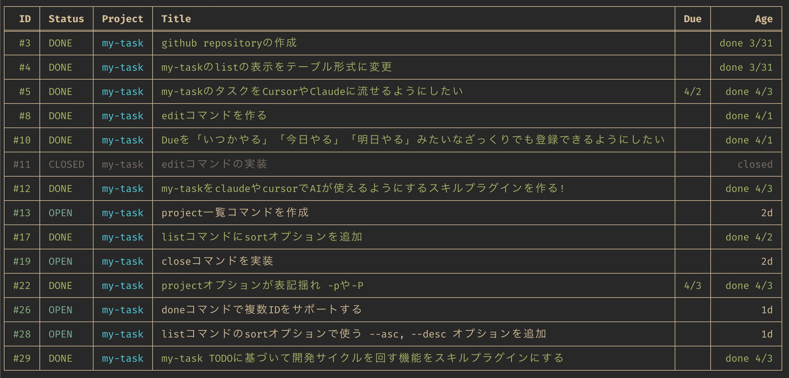
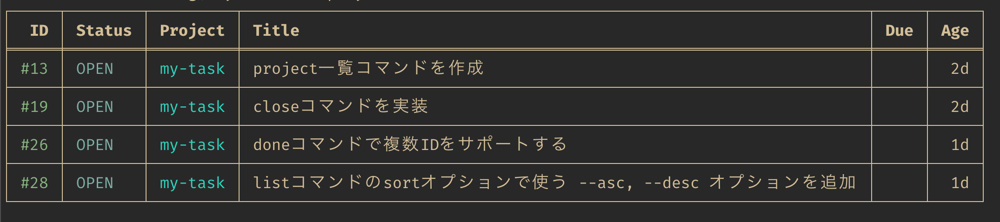

# my-task

SQLiteベースのシンプルなCLIタスクマネージャー。

[English](../README.md)

> **本プロジェクトは開発中です。** 機能やCLIインターフェースは予告なく変更される場合があります。



## 目次

- [インストール](#インストール)
- [使い方](#使い方)
  - [タスクの追加](#タスクの追加)
  - [ざっくりDue入力](#ざっくりdue入力)
  - [タスクの完了](#タスクの完了)
  - [タスクの編集](#タスクの編集)
  - [タスクの一覧表示](#タスクの一覧表示)
  - [タスクのステータス](#タスクのステータス)
- [データ保存先](#データ保存先)
- [Claude Code プラグイン](#claude-code-プラグイン)
- [ライセンス](#ライセンス)
- [コマンドリファレンス](#コマンドリファレンス)

## インストール

> **注意:** 現在はソースからのインストールのみ対応しています。Rustツールチェーンが必要です。

```bash
git clone https://github.com/mad-tmng/my-task.git
cd my-task
cargo install --path .
```

## 使い方

### タスクの追加

```bash
my-task add "買い物に行く"
my-task add "ログインバグの修正" --project my-app --due 2026-04-15
my-task add "テストを書く" --due 明日
```

### ざっくりDue入力

`--due` フラグは日本語・英語の自然言語入力に対応しています:

| 入力 | 結果 |
|------|------|
| `2026-04-15` | そのまま |
| `今日` / `today` | 本日 |
| `明日` / `tomorrow` | 翌日 |
| `明後日` | 2日後 |
| `来週` / `next week` | 7日後 |
| `来月` / `next month` | 翌月同日 |
| `月曜`〜`日曜` / `mon`〜`sun` | 次のその曜日 |

### タスクの完了

```bash
my-task done 1
```

### タスクの編集

#### フラグ指定式（ワンライナー）

```bash
my-task edit 5 --title "新しいタイトル"
my-task edit 5 --project new-proj --due 金曜
```

#### インタラクティブモード（エディター）

`$EDITOR`（未設定の場合は `vi`）でYAML形式のタスク一覧を開きます。ブロックを削除するとそのタスクがクローズされます。

```bash
my-task edit -i              # 全未完了タスクを編集
my-task edit -i 5            # 単体タスクを編集
my-task edit -i -P my-app    # プロジェクトで絞って編集
```

### タスクの一覧表示

```bash
my-task list                 # 未完了タスクのみ
my-task ls                   # エイリアス
my-task list --all           # 完了・クローズ済みも表示
my-task list -P my-app       # プロジェクトで絞り込み
my-task list --sort due      # ソート: id, due, project, created
```



### タスクのステータス

| ステータス | 説明 |
|-----------|------|
| **Open** | 未完了のタスク |
| **Done** | `done` コマンドで完了 |
| **Closed** | `edit -i` でブロック削除によりクローズ |

## データ保存先

タスクデータはSQLiteデータベースに保存されます:

```
$XDG_DATA_HOME/my-task/tasks.db
```

デフォルト: `~/.local/share/my-task/tasks.db`

環境変数 `MY_TASK_DATA_FILE` で上書き可能です。

## Claude Code プラグイン

`cc-plugin/` には、このプロジェクト向けの Claude Code プラグインが含まれています。`task-dev-cycle` コマンドにより、`my-task` のタスク選択から実装・テスト・完了までの開発サイクルを支援します。

マーケットプレイスからのインストール:

```bash
/plugin marketplace add tominaga-h/my-task
/plugin install task-dev-cycle@my-task
```

インストール後は `/task-dev-cycle` を実行してください。利用時は、事前に `my-task` コマンドが使える状態である必要があります。

## ライセンス

MIT

## コマンドリファレンス

### `my-task add <TITLE> [OPTIONS]`

新しいタスクを追加する。

| オプション | 短縮 | 説明 |
|-----------|------|------|
| `--project <NAME>` | `-p` | プロジェクトに割り当て |
| `--due <DATE>` | `-d` | 期限を設定（YYYY-MM-DD またはざっくり入力） |

- `<TITLE>` は必須。空文字はエラー。
- 出力: `Added: #<ID> <TITLE>`
- タイトルが空または期限が不正な場合、終了コード `1`。

### `my-task done <ID>`

タスクを完了にする。ステータスを `done` に変更し、完了日を記録する。

- `<ID>` は必須（正の整数）。
- 出力: `Done: #<ID> <TITLE>`
- タスクが見つからない、または既に完了済みの場合、終了コード `1`。

### `my-task edit [ID] [OPTIONS]`

既存タスクを編集する。2つのモードがある。

#### フラグモード

`<ID>` と、`--title`・`--project`・`--due` のいずれか1つ以上が必須。

| オプション | 短縮 | 説明 |
|-----------|------|------|
| `--title <TEXT>` | `-t` | 新しいタイトルを設定（空文字不可） |
| `--project <NAME>` | `-p` | 新しいプロジェクト名を設定 |
| `--due <DATE>` | `-d` | 新しい期限を設定（YYYY-MM-DD またはざっくり入力） |

- 出力: `Updated: #<ID> <TITLE>`
- フラグ未指定、タスク未検出、タイトル空の場合、終了コード `1`。

#### インタラクティブモード（`-i` / `--interactive`）

`$EDITOR`（フォールバック: `vi`）でYAML形式のタスクを開く。

| オプション | 短縮 | 説明 |
|-----------|------|------|
| `--interactive` | `-i` | エディターモードを有効化 |
| `--filter-project <NAME>` | `-P` | プロジェクトでフィルタ（`-i` と併用） |

- `[ID]` は省略可: 指定時は単体編集、省略時は全未完了タスクを編集。
- エディターでタスクブロックを削除すると、そのタスクが **クローズ** される（ステータスが `closed` に変更）。
- 変更のあったタスクのみ更新。変更なしのタスクはスキップ。
- 出力: `Updated N tasks`、`Closed N tasks`、または `No changes`
- `-i` は `--title`・`--project`・`--due` と併用不可。

### `my-task list [OPTIONS]`

タスクをテーブル形式で表示する。エイリアス: `my-task ls`

| オプション | 短縮 | デフォルト | 説明 |
|-----------|------|----------|------|
| `--all` | `-a` | `false` | 完了・クローズ済みも含めて表示 |
| `--project <NAME>` | `-P` | — | プロジェクトでフィルタ |
| `--sort <KEY>` | `-s` | `id` | ソート: `id`, `due`, `project`, `created`（`age` は `created` のエイリアス） |

**表示ルール:**
- Openタスク: デフォルト色。期限超過のタイトル・due は赤、当日は黄、未来は緑。
- Doneタスク: 全カラム緑（Projectカラムはプロジェクト固有色を維持）。
- Closedタスク: 全カラムダークグレー。
- Ageカラム: 30日超は赤、7日超は黄。
- `--sort due`: 期限未設定のタスクは末尾に表示。

**フッター出力:** `N tasks` または `N tasks (M done)`
